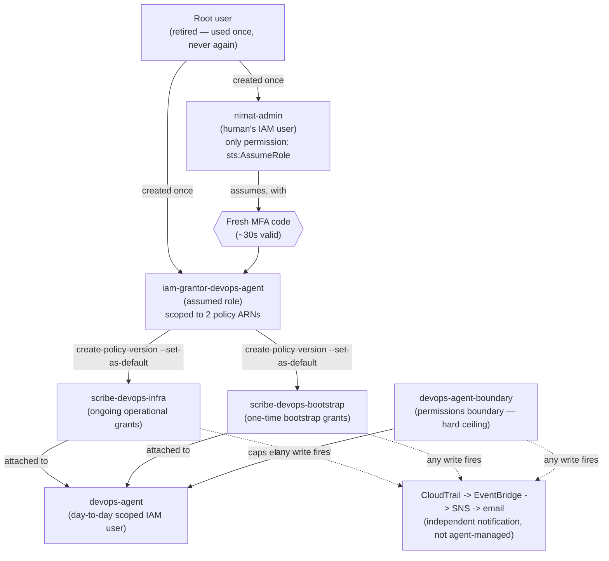
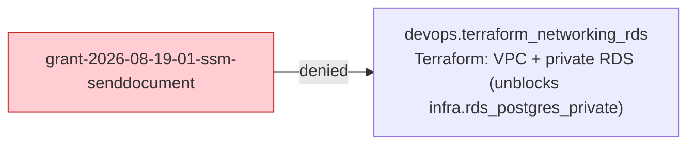

# devops-request-grant — Graphs

Two diagrams. Section 1 is static (the architecture itself, hand-maintained). Section 2 is
auto-generated from `feature-list.json` by `scripts/generate-feature-graph.py` — regenerate it
with the command below rather than hand-editing; anything between the `GENERATED` marker
comments gets overwritten on the next run.

## 1. Identity / trust chain (static — update only if the architecture itself changes)



## 2. Grant → unblocked-feature dependency graph (auto-generated)

Regenerate after any change to `feature-list.json`:

```bash
python3 scripts/generate-feature-graph.py \
  .claude/skills/devops-request-grant/feature-list.json \
  --out .claude/skills/devops-request-grant/graph.md \
  --relation blocks \
  --external devops/feature-list.json \
  --title "Grant requests -> unblocked devops features"
```

<!-- GENERATED:feature-graph:BEGIN (do not edit by hand -- run scripts/generate-feature-graph.py) -->

### Grant requests -> unblocked devops features

_1 entries._



<!-- GENERATED:feature-graph:END -->
