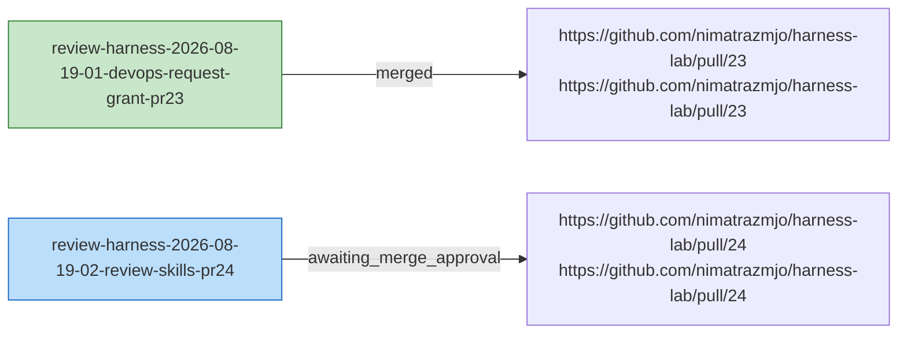

<!-- GENERATED:feature-graph:BEGIN (do not edit by hand -- run scripts/generate-feature-graph.py) -->

### review-harness review cycles

_2 entries._

```mermaid
flowchart LR
    n_review_harness_2026_08_19_01_devops_request_grant_pr23["review-harness-2026-08-19-01-devops-request-grant-pr23"]
    n_ext_https___github_com_nimatrazmjo_harness_lab_pull_23["https://github.com/nimatrazmjo/harness-lab/pull/23<br/>https://github.com/nimatrazmjo/harness-lab/pull/23"]
    n_review_harness_2026_08_19_01_devops_request_grant_pr23 -- "merged" --> n_ext_https___github_com_nimatrazmjo_harness_lab_pull_23
    n_review_harness_2026_08_19_02_review_skills_pr24["review-harness-2026-08-19-02-review-skills-pr24"]
    n_ext_https___github_com_nimatrazmjo_harness_lab_pull_24["https://github.com/nimatrazmjo/harness-lab/pull/24<br/>https://github.com/nimatrazmjo/harness-lab/pull/24"]
    n_review_harness_2026_08_19_02_review_skills_pr24 -- "awaiting_merge_approval" --> n_ext_https___github_com_nimatrazmjo_harness_lab_pull_24
    style n_review_harness_2026_08_19_01_devops_request_grant_pr23 fill:#c8e6c9,stroke:#2e7d32
    style n_review_harness_2026_08_19_02_review_skills_pr24 fill:#bbdefb,stroke:#1565c0
```

<!-- GENERATED:feature-graph:END -->
