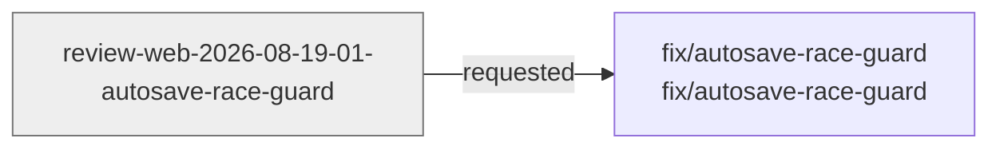

<!-- GENERATED:feature-graph:BEGIN (do not edit by hand -- run scripts/generate-feature-graph.py) -->

### review-web review cycles

_1 entries._

```mermaid
flowchart LR
    n_review_web_2026_08_19_01_autosave_race_guard["review-web-2026-08-19-01-autosave-race-guard"]
    n_ext_fix_autosave_race_guard["fix/autosave-race-guard<br/>fix/autosave-race-guard"]
    n_review_web_2026_08_19_01_autosave_race_guard -- "requested" --> n_ext_fix_autosave_race_guard
    style n_review_web_2026_08_19_01_autosave_race_guard fill:#eeeeee,stroke:#757575
```

<!-- GENERATED:feature-graph:END -->
