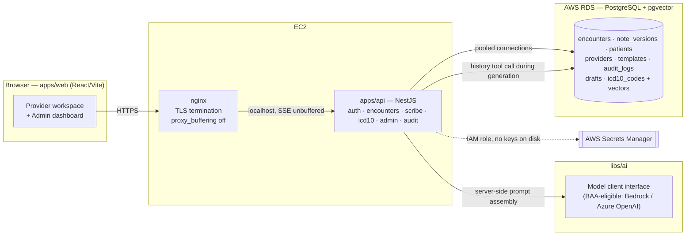
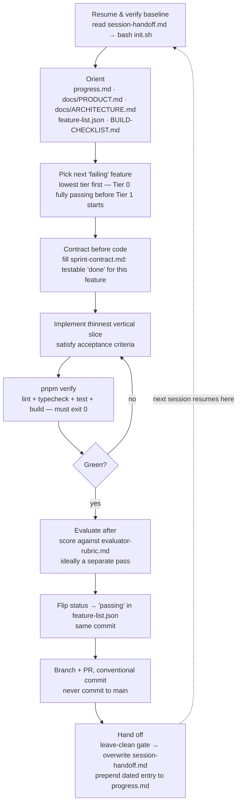

# AI Clinical Scribe

A provider-facing clinical documentation tool. A physician pastes an encounter transcript (or
types freeform notes); the AI **streams back** a structured **SOAP note** (Subjective, Objective,
Assessment, Plan) with matched **ICD-10** codes. The AI drafts, the provider reviews and edits
before anything saves — this is a human-in-the-loop tool, not an autonomous one.

This repo doubles as a **harness-lab**: the product code is built almost entirely by AI coding
agents (Claude Code, Cursor, etc.) working against an explicit, file-based contract rather than
free-form prompting. That contract — what to build, in what order, how "done" is defined and
checked — is the second thing this repo demonstrates, alongside the app itself.

---

## Table of contents

- [What this is](#what-this-is)
- [Product](#product)
- [Architecture](#architecture)
- [Repo layout](#repo-layout)
- [Running it](#running-it)
- [The harness — how the agent workflow works](#the-harness--how-the-agent-workflow-works)
- [Invariants — what an agent must never violate](#invariants--what-an-agent-must-never-violate)
- [Build status](#build-status)
- [DevOps workstream](#devops-workstream)

---

## What this is

Two things layered on top of each other:

1. **A real app** — NestJS API + React/Vite frontend, Postgres/pgvector on RDS, streaming
   AI-generated clinical notes, tenant isolation, immutable versioning. See [Product](#product)
   and [Architecture](#architecture).
2. **A harness** — a set of markdown/JSON files (`AGENTS.md`, `feature-list.json`,
   `session-handoff.md`, `progress.md`, `sprint-contract.md`, `evaluator-rubric.md`,
   `clean-state-checklist.md`) plus Claude Code skills that turn "build this app" into a
   repeatable, auditable, multi-session process any agent can pick up cold. See
   [The harness](#the-harness--how-the-agent-workflow-works).

The premise: an agent given a vague goal and a long context window drifts — it re-litigates
decisions, forgets invariants, declares things "done" without proof. The harness exists to make
each session cheap to resume, hard to cheat, and self-correcting.

---

## Product

**Users**

| Role         | Sees                                   | Does                                                          |
|--------------|-----------------------------------------|----------------------------------------------------------------|
| **Provider** | Only their own encounters/patients      | Create encounters, generate/edit/save SOAP notes               |
| **Admin**    | All encounters (via explicit admin guard) | Manage provider roster, own the note-template library         |

**Core workflow**

1. Provider starts an encounter (patient name + DOB).
2. Pastes a transcript or types observations, optionally picks a template.
3. **Generate** → SOAP note streams back progressively (token-by-token), with ICD-10 codes
   matched to the content.
4. Provider edits inline, saves. Every save is a new **immutable** version — nothing is ever
   overwritten.

**Non-negotiable product behavior**

- **Never fabricate.** No clinical content in the input → graceful "insufficient content"
  response, no invented note, no invented ICD-10 code.
- **Context-aware, not context-leaky.** A returning patient's prior assessment/plan informs
  generation for *whichever* provider is currently treating them (continuity of care) — but a
  provider can never directly read another provider's encounter record. See
  [Invariants](#invariants--what-an-agent-must-never-violate).
- **Nothing is lost.** Drafts survive refresh/device changes; a session expiring mid-save never
  drops the draft.

Full product intent lives in [`docs/PRODUCT.md`](docs/PRODUCT.md).

---

## Architecture



**Request path — generating a note** (the core flow; see
[`docs/ARCHITECTURE.md`](docs/ARCHITECTURE.md) for the full rationale):

1. Provider `POST`s transcript to the streaming endpoint (SSE **over POST** — `EventSource` is
   GET-only and the transcript is a large, PHI-shaped body).
2. API runs a clinical-content safety check; empty/garbage input emits `insufficient_content`
   and stops — no note is generated.
3. API loads the **active template server-side** (read fresh every call, so admin template edits
   apply live, no redeploy).
4. API fetches prior patient history via a **backend tool/function call** — never from the
   client, never in the frontend prompt. Empty for first-time patients, so behavior is
   demonstrably different by construction.
5. API assembles `template + history + transcript` and **streams** model tokens back over SSE.
6. On completion, API parses the structured SOAP output and **validates ICD-10 codes against the
   DB** — hallucinated codes are dropped before the note becomes editable.
7. Provider edits inline → saves → a new **immutable** `note_versions` row is inserted (never
   `UPDATE`/`DELETE`), and an audit row is logged.

**Stack**

- **API** — NestJS (`apps/api`): auth, encounters, scribe (SSE), icd10, admin, audit, drafts,
  templates, patients, health.
- **Web** — React/Vite (`apps/web`): provider workspace + admin dashboard, feature-sliced
  (`auth`, `encounter`, `note`, `icd10`, `admin`).
- **Shared contract** — `libs/shared-types`: DTOs + zod schemas imported by both API and web, so
  a breaking backend change fails at **typecheck**, not at runtime.
- **AI layer** — `libs/ai`: prompt templates, the model-client interface, and tool/function
  definitions. Two model roles — a strong low-latency model for streaming SOAP generation, a
  cheap embedding model for ICD-10 semantic search.
- **Persistence** — AWS RDS Postgres + `pgvector` (HNSW index, cosine distance) is the *only*
  durable store. One shared connection pool per process. Schema changes only via migration.
- **Infra** — EC2 + nginx (TLS termination, reverse proxy, `proxy_buffering off` so SSE streams
  progressively instead of collapsing into spinner-then-dump); RDS has no public IP; Secrets
  Manager reached via IAM role, no long-lived keys on disk.

---

## Repo layout

```
apps/
  api/            NestJS — auth, encounters, scribe (SSE), icd10, admin, audit
  web/            React/Vite — provider workspace, admin dashboard
libs/
  shared-types/   DTOs + zod schemas shared by api AND web (single contract source)
  ai/             prompt templates, model client, tool/function-call definitions
infra/            nginx conf, docker-compose (local pg+pgvector), Terraform, deploy notes
tools/            tools/init.sh (full env bootstrap), seed scripts, icd10 embedding loader
docs/             PRODUCT.md (what & why), ARCHITECTURE.md (how it fits together)
devops/           separate, on-demand workstream — containers/Terraform/CI-CD (own harness)
scripts/          verify-tls.sh, check-no-committed-secrets.sh

AGENTS.md              the harness contract — single source of truth for any AI agent
CLAUDE.md               one-line bridge: imports AGENTS.md for Claude Code
init.sh                 fast build-verify gate: install + typecheck + build
progress.md             rolling, append-only session log
session-handoff.md      warm baton-pass — overwritten every session, read first to resume
clean-state-checklist.md  start-clean / leave-clean gates run at both ends of a session
feature-list.json       the prioritized, tier-ordered source of truth (40 features)
sprint-contract.md      per-feature "done", agreed BEFORE coding
evaluator-rubric.md     adversarial scorecard applied AFTER coding
BUILD-CHECKLIST.md      phased day-by-day build sequence with "Done when" gates
```

---

## Running it

```bash
pnpm setup          # ONE-TIME: local pg+pgvector via Docker, migrations, seed data
pnpm dev            # run api + web together

bash init.sh         # fast gate: install + typecheck + build (run every session)
pnpm verify          # full gate: lint + typecheck + test + build — must exit 0 before "done"
pnpm test:e2e        # API e2e (supertest) + web e2e (Playwright)

pnpm db:migrate      # apply a pending migration
pnpm db:seed         # 3 provider accounts + 1 admin + ~200-300 ICD-10 codes
pnpm icd10:embed     # compute + store ICD-10 embeddings into pgvector
```

Copy `.env.example` → `.env` and fill in local values — real secrets never live in the repo; in
deployed environments they load from AWS Secrets Manager at runtime.

---

## The harness — how the agent workflow works

Every session — human or agent — follows the same loop, defined in
[`AGENTS.md`](AGENTS.md) (the single source of truth; `CLAUDE.md` is a one-line import so Claude
Code picks it up automatically).



**Why each file exists**

| File | Role |
|---|---|
| `AGENTS.md` | The contract itself — invariants, repo map, commands, workflow rules. Everything else derives from it. |
| `feature-list.json` | 40 features in 3 tiers (0 = airtight core + infra, 1 = differentiators, 2 = stretch). The only ordering an agent should follow — never start Tier 1 before Tier 0 is fully `passing`. |
| `session-handoff.md` | Overwritten every session. What to read *first* to resume cold — no re-exploring the repo from scratch. |
| `progress.md` | Append-only. What happened, session by session — durable history `session-handoff.md` doesn't keep. |
| `sprint-contract.md` | Filled in **before** writing code for a feature — the testable definition of "done," agreed up front so scope can't drift mid-implementation. |
| `evaluator-rubric.md` | Applied **after** coding, ideally by a separate pass/agent — an agent grading its own fresh work skews positive, so self-grading is treated as unreliable by design. |
| `clean-state-checklist.md` | Start-clean / leave-clean gates — run at both ends of every session so state never rots between agents. |
| `BUILD-CHECKLIST.md` | The concrete phase order within the tier structure, with a "Done when" gate per phase. |

**Three build gates, three jobs** (deliberately not one script):

- **`bash init.sh`** — first thing every session. No Docker, no DB: install + typecheck + build.
  Fast, side-effect-free, answers "does the code still compile."
- **`pnpm verify`** — the real gate for finishing a feature: lint + typecheck + test + build.
  Success is silent, failures are verbose. Required green before `status` flips to `passing`.
- **`pnpm setup`** — one-time (or after an infra change) environment bootstrap: Docker, local
  Postgres/pgvector, migrations, seed data. Not a per-session habit.

**Isolated workstream: DevOps.** Containers, Terraform, and CI/CD are handled by a *separate*
on-demand workstream (`devops/`) invoked only via the `/devops` Claude Code skill — see
[DevOps workstream](#devops-workstream). This keeps infra detail out of normal product-coding
context entirely, rather than relying on the agent to self-filter.

**The ratchet.** Every agent mistake becomes a permanent harness fix, not a one-off correction:
forgot `provider_id` scoping → add a lint rule or a test that must stay green; declared a feature
done with a failing test → tighten `pnpm verify`. `AGENTS.md` §12 states this explicitly — the
file is expected to keep getting stricter as real failures are found, not to stay static.

---

## Invariants — what an agent must never violate

The full list is `AGENTS.md` §2; the ones that most shape the code:

- **[SECRETS]** No hardcoded credentials, ever. `.env` is git-ignored; real values come from AWS
  Secrets Manager at runtime.
- **[PERSISTENCE]** Everything durable lives in RDS Postgres — no SQLite, no in-memory store, no
  flat files.
- **[TENANT-ISOLATION]** A provider can never directly read/write another provider's encounter
  record — covered by a test that must stay green. (Patient-scoped clinical *history* crossing
  providers for continuity of care is an explicit, human-approved exception — see
  `AGENTS.md` §2 for the exact scope.)
- **[VERSION-IMMUTABILITY]** Editing a note **INSERTs**; it never `UPDATE`s or `DELETE`s a prior
  `note_versions` row.
- **[STREAMING]** Note generation is SSE, token-by-token. Spinner-then-dump is not "done."
- **[POOLING]** One shared connection pool per process — never a connection per request.
- **[CONTEXT-INJECTION]** Prior-patient history is fetched server-side by a backend tool call —
  never assembled or sent from the client.
- **[CLINICAL-SAFETY]** The AI drafts, the provider reviews before save. No clinically meaningful
  content in → no fabricated note, ever.

---

## Build status

38 of 40 product features are `passing`; 2 are `blocked` on real AWS infrastructure
(`infra.rds_postgres_private`, `infra.ec2_nginx_tls`) — deliberately left to the `devops/`
workstream rather than faked with a mock. Current state in detail: `session-handoff.md` and
`feature-list.json`.

---

## DevOps workstream

Containerizing the app, provisioning AWS via Terraform, and a GitHub Actions CI/CD pipeline
(secret scan → build → Trivy CRITICAL/HIGH scan → OIDC-authenticated push to ECR with immutable
SHA tags → SSM-driven deploy → rollback workflow) live entirely under `devops/` with their own
`AGENTS.md`, `feature-list.json`, and session-handoff cycle — mirroring the root harness but
scoped so infra concerns never load into a normal product-coding session.

Invoke it with the `/devops` skill. Its non-negotiables include: no static AWS credentials
anywhere (OIDC only), never the AWS root user (hard-enforced by `devops/init.sh`), never `latest`
as an image tag (ECR repos are tag-immutable), `terraform apply` only from CI on merge to `main`,
and a no-touch zone on `apps/*/src` and `libs/**` — devops changes infrastructure, not product
code. Full contract: [`devops/AGENTS.md`](devops/AGENTS.md).
