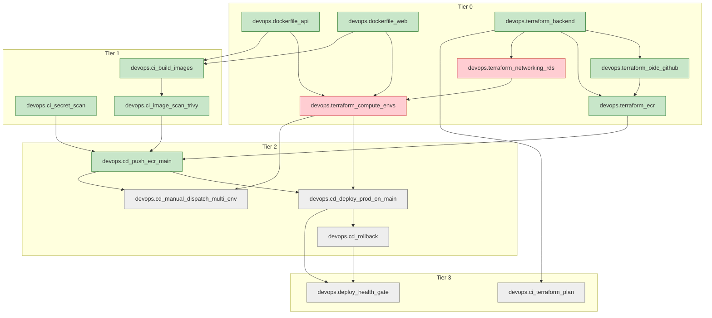

<!-- GENERATED:feature-graph:BEGIN (do not edit by hand -- run scripts/generate-feature-graph.py) -->

### DevOps workstream — feature dependency graph

_16 features: 2 blocked, 5 failing, 9 passing._

<!-- GENERATED:feature-graph:END -->
