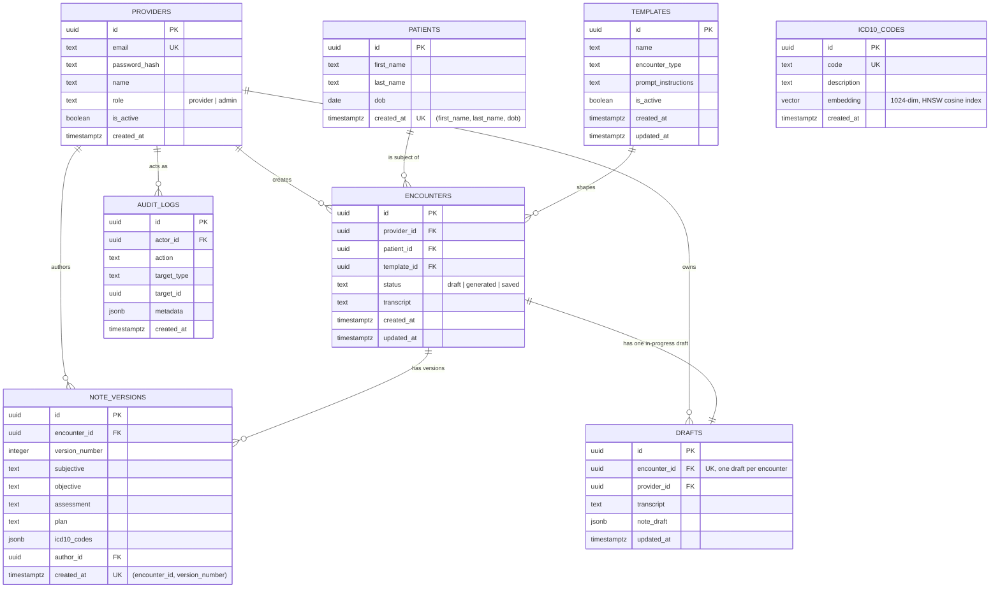

# ERD — AI Clinical Scribe

Schema source of truth: `apps/api/migrations/1755380000001_create-core-schema.sql`. Every table
here is justified against a Tier 0/1 feature — nothing speculative.

## Table-by-table rationale

- **providers** — auth identity + role (`provider`/`admin`). `is_active` lets admin deactivate an
  account without deleting audit/version history that references it (FK survives).
- **patients** — deduplicated by `(first_name, last_name, dob)` so a returning patient's
  encounters link to one row, which is what makes context injection possible.
- **templates** — admin-owned prompt shaping. Read fresh per generation (no cache) so
  `admin.template_live_update` needs no extra plumbing — it's just "don't cache."
- **encounters** — one per visit; carries the raw transcript and links provider + patient +
  template. `status` tracks the workflow (`draft` → `generated` → `saved`).
- **note_versions** — append-only by construction: `(encounter_id, version_number)` is unique and
  the app layer only ever INSERTs (see AGENTS.md [VERSION-IMMUTABILITY]). `author_id` +
  `created_at` give the audit trail required by `note.version_history`.
- **drafts** — one row per encounter (`UNIQUE(encounter_id)`), upserted as the provider types, so
  a refresh or a different device restores exactly where they left off
  (`session.draft_persist`, `session.cross_device`).
- **audit_logs** — generic actor/action/target log for saves and admin actions
  (`audit.trail`). `actor_id` is nullable so a system action (if ever needed) doesn't need a fake
  provider.
- **icd10_codes** — the only ICD-10 source of truth (no external API). `embedding vector(1024)`
  with an HNSW cosine index backs `icd10.vector_search`; dimension must match
  `AI_EMBEDDING_DIMENSIONS`.

## Indexing
FKs used in every provider-facing query are indexed (`encounters.provider_id`,
`encounters.patient_id`, `note_versions.encounter_id`, `drafts.provider_id`,
`audit_logs.actor_id`) plus `audit_logs.created_at` for date-range filtering
(`admin.view_all`), and an HNSW vector index on `icd10_codes.embedding`.
