<!-- GENERATED:feature-graph:BEGIN (do not edit by hand -- run scripts/generate-feature-graph.py) -->

### AI Clinical Scribe — feature dependency graph

_40 features: 2 blocked, 38 passing._

```mermaid
flowchart TD
    subgraph tier0["Tier 0"]
        n_infra_env_secrets["infra.env_secrets"]
        n_infra_rds_postgres_private["infra.rds_postgres_private"]
        n_infra_connection_pooling["infra.connection_pooling"]
        n_infra_ec2_nginx_tls["infra.ec2_nginx_tls"]
        n_infra_schema_erd["infra.schema_erd"]
        n_auth_login["auth.login"]
        n_auth_roles_seed["auth.roles_seed"]
        n_auth_tenant_isolation["auth.tenant_isolation"]
        n_encounter_create["encounter.create"]
        n_encounter_input["encounter.input"]
        n_scribe_generate_stream["scribe.generate_stream"]
        n_scribe_soap_sections["scribe.soap_sections"]
        n_scribe_icd10_assessment["scribe.icd10_assessment"]
        n_note_inline_edit["note.inline_edit"]
        n_note_save["note.save"]
        n_note_versioning_immutable["note.versioning_immutable"]
        n_note_version_history["note.version_history"]
    end
    subgraph tier1["Tier 1"]
        n_admin_shell_route["admin.shell_route"]
        n_admin_view_all["admin.view_all"]
        n_admin_roster["admin.roster"]
        n_admin_templates_crud["admin.templates_crud"]
        n_admin_template_select["admin.template_select"]
        n_admin_template_live_update["admin.template_live_update"]
        n_admin_nav_wired["admin.nav_wired"]
        n_ui_professional_redesign["ui.professional_redesign"]
        n_session_draft_persist["session.draft_persist"]
        n_session_cross_device["session.cross_device"]
        n_edge_no_clinical_content["edge.no_clinical_content"]
        n_edge_session_expired_save["edge.session_expired_save"]
        n_audit_trail["audit.trail"]
        n_patient_match["patient.match"]
        n_context_history_injection["context.history_injection"]
        n_context_behavior_differs["context.behavior_differs"]
        n_icd10_vector_search["icd10.vector_search"]
        n_icd10_search_widget["icd10.search_widget"]
        n_icd10_append_assessment["icd10.append_assessment"]
    end
    subgraph tier2["Tier 2"]
        n_pioneer_version_diff["pioneer.version_diff"]
        n_pioneer_writing_style["pioneer.writing_style"]
        n_pioneer_red_flags["pioneer.red_flags"]
        n_pioneer_bulk_pdf["pioneer.bulk_pdf"]
    end
    n_infra_env_secrets --> n_infra_rds_postgres_private
    n_infra_rds_postgres_private --> n_infra_connection_pooling
    n_infra_env_secrets --> n_infra_ec2_nginx_tls
    n_infra_rds_postgres_private --> n_infra_schema_erd
    n_infra_schema_erd --> n_auth_login
    n_auth_login --> n_auth_roles_seed
    n_auth_roles_seed --> n_auth_tenant_isolation
    n_auth_tenant_isolation --> n_encounter_create
    n_encounter_create --> n_encounter_input
    n_encounter_input --> n_scribe_generate_stream
    n_scribe_generate_stream --> n_scribe_soap_sections
    n_scribe_soap_sections --> n_scribe_icd10_assessment
    n_scribe_icd10_assessment --> n_note_inline_edit
    n_note_inline_edit --> n_note_save
    n_note_save --> n_note_versioning_immutable
    n_note_versioning_immutable --> n_note_version_history
    n_note_version_history --> n_admin_shell_route
    n_admin_shell_route --> n_admin_view_all
    n_admin_view_all --> n_admin_roster
    n_admin_view_all --> n_admin_templates_crud
    n_admin_templates_crud --> n_admin_template_select
    n_admin_template_select --> n_admin_template_live_update
    n_admin_shell_route --> n_admin_nav_wired
    n_admin_view_all --> n_admin_nav_wired
    n_admin_roster --> n_admin_nav_wired
    n_admin_templates_crud --> n_admin_nav_wired
    n_audit_trail --> n_admin_nav_wired
    n_admin_nav_wired --> n_ui_professional_redesign
    n_note_inline_edit --> n_ui_professional_redesign
    n_encounter_input --> n_ui_professional_redesign
    n_encounter_input --> n_session_draft_persist
    n_session_draft_persist --> n_session_cross_device
    n_scribe_icd10_assessment --> n_edge_no_clinical_content
    n_session_draft_persist --> n_edge_session_expired_save
    n_note_versioning_immutable --> n_audit_trail
    n_note_version_history --> n_pioneer_version_diff
    n_context_history_injection --> n_pioneer_writing_style
    n_scribe_generate_stream --> n_pioneer_red_flags
    n_note_version_history --> n_pioneer_bulk_pdf
    n_note_version_history --> n_patient_match
    n_patient_match --> n_context_history_injection
    n_context_history_injection --> n_context_behavior_differs
    n_note_version_history --> n_icd10_vector_search
    n_icd10_vector_search --> n_icd10_search_widget
    n_icd10_search_widget --> n_icd10_append_assessment
    style n_infra_env_secrets fill:#c8e6c9,stroke:#2e7d32
    style n_infra_rds_postgres_private fill:#ffcdd2,stroke:#c62828
    style n_infra_connection_pooling fill:#c8e6c9,stroke:#2e7d32
    style n_infra_ec2_nginx_tls fill:#ffcdd2,stroke:#c62828
    style n_infra_schema_erd fill:#c8e6c9,stroke:#2e7d32
    style n_auth_login fill:#c8e6c9,stroke:#2e7d32
    style n_auth_roles_seed fill:#c8e6c9,stroke:#2e7d32
    style n_auth_tenant_isolation fill:#c8e6c9,stroke:#2e7d32
    style n_encounter_create fill:#c8e6c9,stroke:#2e7d32
    style n_encounter_input fill:#c8e6c9,stroke:#2e7d32
    style n_scribe_generate_stream fill:#c8e6c9,stroke:#2e7d32
    style n_scribe_soap_sections fill:#c8e6c9,stroke:#2e7d32
    style n_scribe_icd10_assessment fill:#c8e6c9,stroke:#2e7d32
    style n_note_inline_edit fill:#c8e6c9,stroke:#2e7d32
    style n_note_save fill:#c8e6c9,stroke:#2e7d32
    style n_note_versioning_immutable fill:#c8e6c9,stroke:#2e7d32
    style n_note_version_history fill:#c8e6c9,stroke:#2e7d32
    style n_admin_shell_route fill:#c8e6c9,stroke:#2e7d32
    style n_admin_view_all fill:#c8e6c9,stroke:#2e7d32
    style n_admin_roster fill:#c8e6c9,stroke:#2e7d32
    style n_admin_templates_crud fill:#c8e6c9,stroke:#2e7d32
    style n_admin_template_select fill:#c8e6c9,stroke:#2e7d32
    style n_admin_template_live_update fill:#c8e6c9,stroke:#2e7d32
    style n_admin_nav_wired fill:#c8e6c9,stroke:#2e7d32
    style n_ui_professional_redesign fill:#c8e6c9,stroke:#2e7d32
    style n_session_draft_persist fill:#c8e6c9,stroke:#2e7d32
    style n_session_cross_device fill:#c8e6c9,stroke:#2e7d32
    style n_edge_no_clinical_content fill:#c8e6c9,stroke:#2e7d32
    style n_edge_session_expired_save fill:#c8e6c9,stroke:#2e7d32
    style n_audit_trail fill:#c8e6c9,stroke:#2e7d32
    style n_pioneer_version_diff fill:#c8e6c9,stroke:#2e7d32
    style n_pioneer_writing_style fill:#c8e6c9,stroke:#2e7d32
    style n_pioneer_red_flags fill:#c8e6c9,stroke:#2e7d32
    style n_pioneer_bulk_pdf fill:#c8e6c9,stroke:#2e7d32
    style n_patient_match fill:#c8e6c9,stroke:#2e7d32
    style n_context_history_injection fill:#c8e6c9,stroke:#2e7d32
    style n_context_behavior_differs fill:#c8e6c9,stroke:#2e7d32
    style n_icd10_vector_search fill:#c8e6c9,stroke:#2e7d32
    style n_icd10_search_widget fill:#c8e6c9,stroke:#2e7d32
    style n_icd10_append_assessment fill:#c8e6c9,stroke:#2e7d32
```

<!-- GENERATED:feature-graph:END -->
